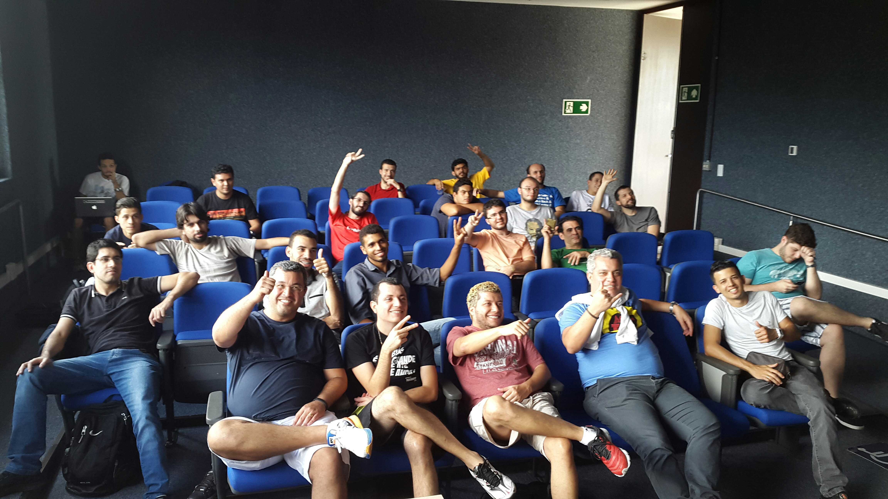

# Challenge [Meetup Mobile Dev BH](http://www.meetup.com/Mobile-Dev-BH/) - April 18, 2015

Hybrid app with [Ionic](http://ionicframework.com/) (The beautiful, open source front-end SDK for developing hybrid mobile apps with HTML5), for the challenge to meetup [Native x Cross Platform x Hybrid - Qual o melhor caminho?](http://www.meetup.com/Mobile-Dev-BH/events/221401419/).

To test [APK Download](https://github.com/tiagoporto/desafio-mobile/raw/master/desafio-meetup-mobile.apk).

## Desafio

Os participantes foram separados em 3 grupos para criarem o mesmo aplicativo, cada um utilizando uma das 3 abordagens.

* **Native** - Foi utilizado Java para criação de aplicativo Android.

* **Cross Platform** - Foi utilizado [Xamarin](http://xamarin.com/), baseado em C#.

* **Hybrid** - Utilizado [Framework Ionic](http://ionicframework.com/), baseado em JavaScritp com [Angular JS](https://angularjs.org/) e [Apache Cordova](https://cordova.apache.org/).

### Requisitos do aplicativo

* SplashScreen.
* Integrar com API do GitHub para buscar os dados de um usuário informado no app.
* Integrar com a Cãmera do dispositivo para tirar uma foto e enviar para o e-mail do usuário retornado pela API do GitHub.
* 2 horas para o desenvolvimento.
