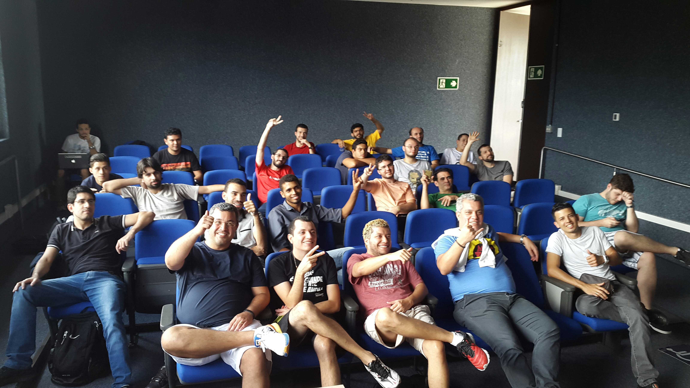
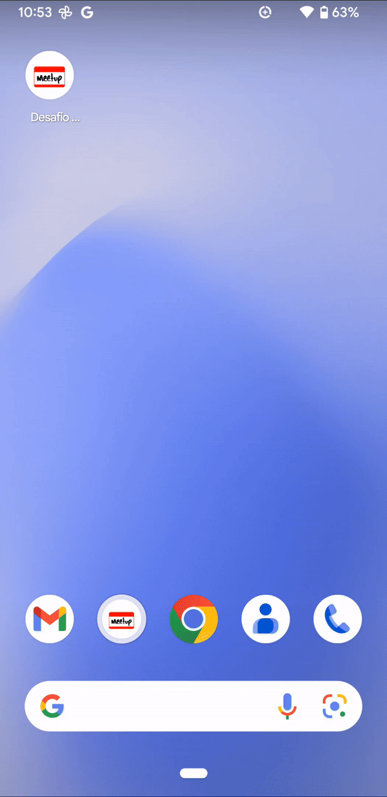
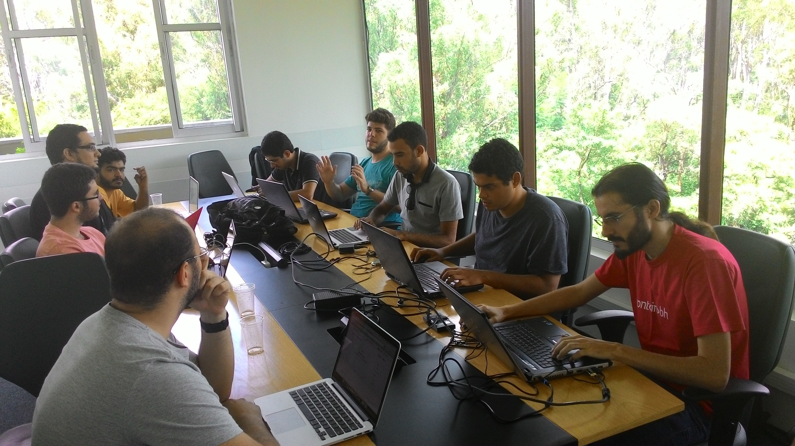

# [Mobile Dev BH](http://www.meetup.com/Mobile-Dev-BH/) Meetup Challenge

> April 18, 2015

Hybrid app with [Ionic](http://ionicframework.com/), [Native x Cross Platform x Hybrid - Qual o melhor caminho?](http://www.meetup.com/Mobile-Dev-BH/events/221401419/) meetup challenge.

## Challenge

All the participants were separated into 3 groups to create the same application, each one using one of 3 approaches.

-   **Native** - Native Android App with Java.

-   **Cross Platform** - [Xamarin](http://xamarin.com/), C# based.

-   **Hybrid** - [Ionic Framework](http://ionicframework.com/), JavaScritp framework with [Angular JS](https://angularjs.org/) e [Apache Cordova](https://cordova.apache.org/).

### App requirements

-   2 hours development.
-   SplashScreen.
-   Fetch user's data from Github.
-   Integrate with device's Camera to take a photo and send it to the user's GitHub email.

### Result

    

    

## Hybrid Group

### Participants

<table>
  <tbody>
    <tr>
      <td align="center">
        
         
        <a href="https://github.com/brenoqueiroz">Breno Queiroz</a>
      </td>
      <td align="center">
        
         
        <a href="https://github.com/Diego-Soares">Diego Soares</a>
      </td>
      <td align="center">
        
         
        <a href="https://github.com/gvsrepins">Gabriel Vítor</a>
      </td>
    </tr>
    <tr>
      <td align="center">
        
         
        <a href="https://github.com/faelcorreia">Rafael Correia</a>
      </td>
      <td align="center">
        
         
        <a href="https://github.com/romulobr">Rômulo Santos</a>
      </td>
      <td align="center">
        
         
        <a href="https://github.com/saliba">Lucas Saliba</a>
      </td>
    </tr>
    <tr>
      <td align="center">
        
         
        <a href="https://github.com/tiagoporto">Tiago Porto</a>
      </td>
      <td align="center">
        
         
        <a href="https://github.com/wallysson-hotmart">Wallysson Nunes</a>
      </td>
      <td align="center">
        
         
        <a href="https://github.com/wilkerfoureaux">Wilker Foureaux</a>
      </td>
    </tr>
  </tbody>
</table>
